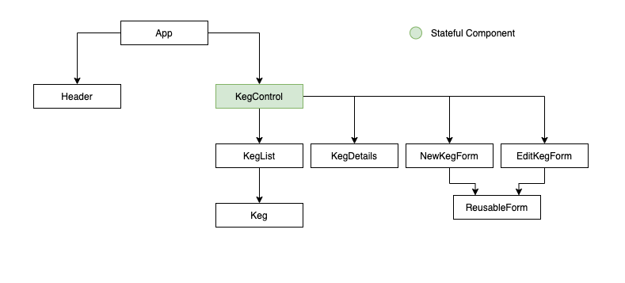

 
<h1 align = "center">
  <b>Tap Room </b>
</h1>

  This is a React with Redux application that allows the user to track kegs using full CRUD.  

 Created February 12, 2021 

  By Kaila Sprague McRae

--------------------

## 📖  Description

This is a React with Redux application that allows the user to track kegs using full CRUD.  

This is an independent project for Epicodus week 16 as part of the "React Fundamentals" coursework. 

--------------------

## 🛠️ Technologies Used

This project uses the following technologies:

- React
- Redux
- JSX
- JavaScript ES6
- Bootstrap 5
- git/GitHub
- VS Code

-------------------

## User Stories

| obj# | User Stories | Complete |
| :------------- | :------------- | :------------- |
| 01 | I want to see a list/menu of all available kegs. | ✅ |
| 02 | I want to submit a form to add a new keg to a list. | ✅ |
| 03 | I want to be able to click on a keg to see its detail page. | ✅ |
| 04 | I want to see how many pints are left in a keg. | ✅ |
| 05 | I want to be able to click a button next to a keg whenever I sell a pint of it. This should decrease the number of pints left by 1. Pints should not be able to go below 0. | ✅ |
| 06 | I want the option to edit a keg's properties after entering them just in case I make a mistake. | ✅ |
| 07 | I want to be able to delete a keg. | ✅ |
| 08 | I want a keg to update to say "Out of Stock" once it's empty. | ✅ |
| 09 | I want kegs with less than 10 pints to include a message that says "Almost Empty" so I can try a pint before it's gone! | ✅ |
| 10 | I want to have kegs prices to be color-coded for easy readability. This could be based on their price, the style of beer or kombucha, or the amount of pints left. | ❌ |
 
-------------------

## Component Tree

-------------------

## 🐛 Known Bugs

| Date | Error | Handled | Solution |
| :------------- | :------------- | :------------- | :------------- |
| 02.12.2021 | cannot read propert 'id' of undefined | ✅ | typo in KegControl |
| 02.19.2021 | Invalid DOM property 'for' | ✅ | changed 'for' to 'htmlFor' in ReusableForm |

-------------------

## 🔧 Setup & Requirements

### 📋 Necessary Specifications

#### To run this project locally you will need:

- **Node.js :** You can check if you have Node.js by running `node -v` in the command line. If you do not have Node.js please find more information and download [here](https://nodejs.org/en/)
* you can also install node through Homebrew by running `brew install node` in the command line.
- **Jest :** If your testing does not run, you may need to install Jest, you can do this by running `npm install jest@24.9.0 --save-dev` in the command line.
- **Prefered Code Editor**

### ⚙️ Clone or Download

#### To Download:

Go to my GitHub repository here, [https://guthub.com/kaila.spraguemcrae/tap-room-redux](https://guthub.com/kaila.spraguemcrae/tap-room-redux), and click on the green 'Code' button to clone the repository, Open with GitHub Desktop OR Download the ZIP file

#### To clone (my prefered method):

1. Push the green 'Clone' button and copy the URL.
2. Open Terminal or GitBash and input the command: `git clone https://github.com/kaila-spraguemcrae/tap-room`
3. To view the code, open the copied directory with Visual Studio Code or your preferred text editor by inputing the command `code .` in your terminal.

### 🧰  Setup Options

#### `npm install` 

This insures you have all of the necessary files to run the program.

#### `npm test`

This allows you to test the applications action creators and reducers.

#### `npm start`

Runs the app in the development mode.\
Open [http://localhost:3000](http://localhost:3000) to view it in the browser.

The page will reload if you make edits.\
You will also see any lint errors in the console.

#### `npm run build`

Builds the app for production to the `build` folder.\
It correctly bundles React in production mode and optimizes the build for the best performance.

The build is minified and the filenames include the hashes.\
Your app is ready to be deployed!

--------------------------

## 📫 Support and contact details

If you run into any problems or have any questions please contact me:
- [Kaila Sprague McRae](mailto:kaila.sprague@icloud.com)

---------------------------

## 📘 License

MIT License

Permission is hereby granted, free of charge, to any person obtaining a copy
of this software and associated documentation files (the "Software"), to deal
in the Software without restriction, including without limitation the rights
to use, copy, modify, merge, publish, distribute, sublicense, and/or sell
copies of the Software, and to permit persons to whom the Software is
furnished to do so, subject to the following conditions:

The above copyright notice and this permission notice shall be included in all
copies or substantial portions of the Software.

THE SOFTWARE IS PROVIDED "AS IS", WITHOUT WARRANTY OF ANY KIND, EXPRESS OR
IMPLIED, INCLUDING BUT NOT LIMITED TO THE WARRANTIES OF MERCHANTABILITY,
FITNESS FOR A PARTICULAR PURPOSE AND NONINFRINGEMENT. IN NO EVENT SHALL THE
AUTHORS OR COPYRIGHT HOLDERS BE LIABLE FOR ANY CLAIM, DAMAGES OR OTHER
LIABILITY, WHETHER IN AN ACTION OF CONTRACT, TORT OR OTHERWISE, ARISING FROM,
OUT OF OR IN CONNECTION WITH THE SOFTWARE OR THE USE OR OTHER DEALINGS IN THE
SOFTWARE.

Copyright (c) 2020 Kaila Sprague McRae
